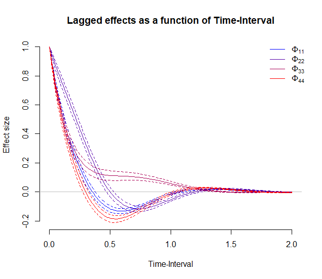
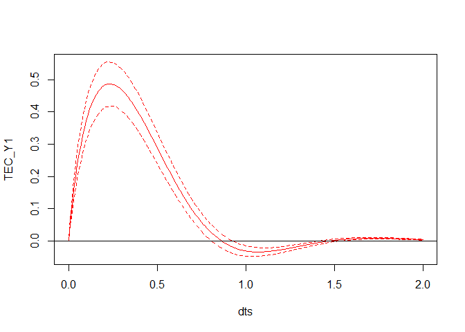
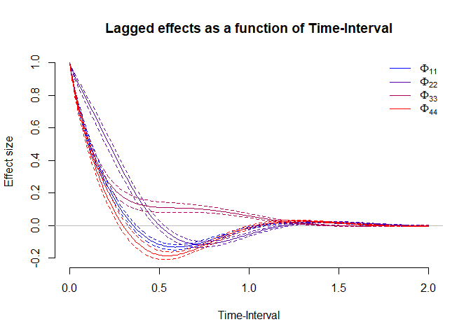
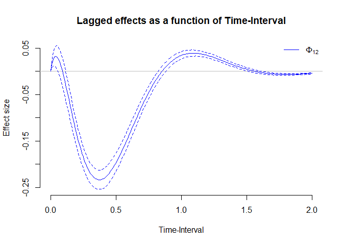

# ctnet

An `R` package to aid researchers in analyzing experience sampling data
using a Continuous-Time Dynamical Network approach.

The package takes either a drift matrix or estimated CT-VAR model object from the [`ctsem` package](https://github.com/cdriveraus/ctsem) and processes the output, allowing researchers to:
  - a) obtain estimated path-specific effects and centrality measures 
  - b) quantify the uncertainty around those measures in the form of confidence/credible intervals (depending on the procedure used to estimated the model with `ctsem`) 
  - c) to simulate interventions based on the estimated model
  - d) plot point estimates and credible intervals for different metrics as a function of the time-interval, as shown below
  




## Background

This repository contains an `R` package used by Ryan & Hamaker (in
press) Time to Intervene: A Continuous-Time Approach to Network Analysis
and Centrality [(https://psyarxiv.com/2ambn/)](https://psyarxiv.com/2ambn/) to conduct
dynamical network analysis using continuous-time first-order vector
autoregressive models (i.e. the integral solution to linear first-order
stochastic differential equations).

## Installation

The current version of this package can be installed directly from
github using

``` r
devtools::install_github("ryanoisin/ctnet")
```


## Usage

The functions in this package primarily rely on output from `ctsem`
models as input, although in principle they can also be used to
calculate and visualize different metrics using only a drift matrix as
input. The main inputs that are needed to work with the packages are a)
a `ctsem::ctStanFit()` object, and b) a `ctsem::ctExtract()` object to
allow for confidence/credible intervals. For more details on how to use
the `ctsem` package we refer readers to the documentation of that
package [here](https://github.com/cdriveraus/ctsem)

The current version of this package focuses on obtaining point estimates
and confidence intervals based on either a single subject ctsem model,
or the *fixed effects* of a multilevel model. As an illustration, we
provide a long single-subject time-series `data/simdata.rda`.

### Fitting a model in ctsem

In order to fit a four-variable CT-VAR(1) model in `ctsem` we would need
to run something like the following code:

``` r
library(ctnet)
library(ctsem)

nvar <- 4

fitmodel <- ctsem::ctModel(latentNames = c("eta1","eta2", "eta3", "eta4"),
                 manifestNames = c("Y1","Y2","Y3", "Y4"),
                 n.manifest = nvar, # number of manifest variables
                 n.latent= nvar, # same number of latent variables (map directly)
                 Tpoints = nobs, # number of observed time points
                 LAMBDA = diag(nrow = nvar), # measurement model (identity)
                 MANIFESTMEANS = matrix(data=0, nrow=nvar, ncol=1),
                 MANIFESTVAR = matrix(data=0, nrow=nvar, ncol=nvar),
                 DRIFT = "auto", # estimate full drift matrix
                 CINT = matrix(data=0, nrow=nvar, ncol=1), # 0 intercepts
                 DIFFUSION = "auto", # full residual matrix
                 MANIFESTTRAITVAR = NULL, # no manifest trait variables
                 type = "stanct"
)

fitmodel$pars$indvarying <- FALSE

# Set optimize = TRUE for frequentist estimation and optimize = FALSE for Bayesian estimation
simfit <- ctsem::ctStanFit(datalong = simdata, ctstanmodel = fitmodel, optimize = TRUE)
```


This code fits a model using Bayesian estimation, saving all of the
necessary output in the `fit` object. A summary, such as point estimates
and credible intervals can be obtained using `summary(fit)`. Point
estimates can be obtained in matrix form, for example by running

``` r
ctsem_results <- summary(simfit)
drift_est <- ctStanContinuousPars(simfit)$DRIFT
```

In order to allow us to calculate confidence intervals around the
path-tracing and centrality metrics, we make use of the
`ctsem::ctExtract()` function to sample drift matrices from the
posterior of the estimated model. This is done as follows

``` r
post <- ctsem::ctExtract(simfit)
post_drift <- post$pop_DRIFT
```

If Bayesian estimation was used, then `post_drift` object now contains
\(1000\) posterior samples of the \(4 \times 4\) drift matrix.
Alternatively if the model was fit using maximum likelihood, \(1000\)
samples from the likelihood of the model are obtained. We will use this
output throughout the functions of the package to obtain
credible/confidence intervals (hereby referred to as CIs). The general
methodology is that we calculate our functions of interest on all of
these sampled drift matrices and then take the 2.5 and 97.5 percentiles
as our CIs. This is illustrated in the following

### Analysing the network structure

With these pieces of `ctsem` output, we can now turn to analysing the
estimated network structure using `ctnet`. For example, we can obtain
the point estimates of the centrality metrics at a particular time
interval, say \(\Delta t = 1\) using the `ctCentrality()` function

``` r
ctCentrality(drift = drift_est, dt = 1)
```

    ##     TEC_eta1     TEC_eta2     TEC_eta3     TEC_eta4     IEC_eta1     IEC_eta2 
    ## -0.030633445  0.037156265 -0.025512334 -0.005515107  0.003992205 -0.050505421 
    ##     IEC_eta3     IEC_eta4 
    ## -0.066549368 -1.043045596

This function returns the total and indirect effect centrality for each
variable at that time-interval. Alternatively, if we want point
estimates *and* CIs we need to supply the `post_drift` object created
above to the `posterior` argument.

``` r
ctCentrality(drift = drift_est, dt = 1, posterior = post_drift)
```

    ##            TEC_Y1     TEC_Y2      TEC_Y3       TEC_Y4       IEC_Y1      IEC_Y2
    ## 2.5%  -0.04617270 0.02757704 -0.03329634 -0.026869602 -0.042643760 -0.07978912
    ## 50%   -0.03028718 0.03661571 -0.02511852 -0.004136929  0.004813181 -0.04962574
    ## 97.5% -0.01418103 0.04686469 -0.01708116  0.018779714  0.063546940 -0.02258113
    ##            IEC_Y3     IEC_Y4
    ## 2.5%  -0.09967804 -1.3353050
    ## 50%   -0.06495229 -1.0442017
    ## 97.5% -0.03155826 -0.8041061

which returns the lower, median, and upper bound of the centrality
estimates.

Typically, we are interested not only in the values of the centrality
metrics at one particular interval, but also in how they change as a
function of the time-interval. To calculate this we can simply apply the
`ctCentrality()` function over a range of values for the time-interval.
This can be done using `apply` or equivalently, by calling calling the
`plotCentrality()` function with argument `plot = FALSE`

``` r
dts = seq(0,2,.01)
centrality_CI <- sapply(dts,function(dt){
  ctCentrality(drift_est,dt,listout=F, posterior = post_drift)
}, simplify = "array")

centrality_CI <- plotCentrality(posterior = post_drift, dts = seq(0,2,.01),plot = FALSE)
```

With this obtained, we can now visualize the estimated centrality
measures, and their CIs, across time-intervals

``` r
plotCentrality(CI_obj = centrality_CI, dts = seq(0,2,.01),plot = TRUE)
```

<!-- -->

Note that the second and last steps can be combined by supplying the
posterior object and `plot = TRUE`, but this will take a while to run.

### Other functions and analyses

Several other functions are supplied. The calculation of total, direct
and indirect effects, as described by Ryan & Hamaker (in press), is
implemented in the functions `TE`, `DE` and `IE`. `simPress` allows
users to simulate the effects of different press interventions on a
given CT-VAR(1) system, though CIs are not implemented. The function
`getCIs` allows you to get point estimates and CIs for any arbitrary
function of the drift matrix, using `post_drift` as input as above for
the centrality measures.

The final function of interest is `plotPhi`. This allows users to easily
plot the model-implied lagged effects \(\Phi(\Delta t)\) and their CIs
for a range of time-intervals. The functionality is very similar to the
`plotCentrality` functions. Users are recommended to first obtain the
posterior CIs of \(\Phi(\Delta t)\) as an object (as this can take some
time to run) before plotting using either of the two equivalent
approaches

``` r
phidt_CI <- sapply(dts,function(dt){
  getCIs(post_drift,simplify=TRUE, FUN=expm::expm, const = dt)
}, simplify = "array")

phidt_CI <- plotPhi(posterior = post_drift, dts = dts, plot = FALSE )
```

With this obtained, we can now visualize the estimated effects, and
their CIs, across time-intervals. We can choose to visualize all effects
at once by using the argument `index = "all"`; only the autoregressive
paramters using `index = "AR"`; or the cross-lagged parameters using
`index = "CL"`. Alternatively, \(q\) specific parameters can be shown by
supplying a \(q \times 2\) matrix of row and column indices to `index`.

``` r
 plotPhi(CI_obj = phidt_CI, dts = dts,  index = "AR", leg = TRUE)
```

<!-- -->

``` r
 plotPhi(CI_obj = phidt_CI, dts = dts,  index = matrix(c(1,2),1,2), colvec = NULL, leg = TRUE)
```

<!-- -->

## Contact Details

For more details please contact **<o.ryan@uu.nl>**
